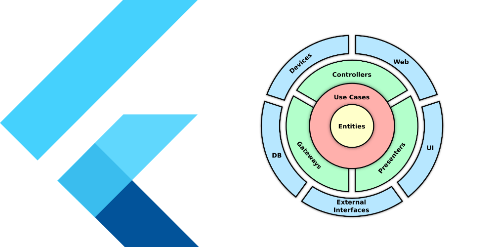
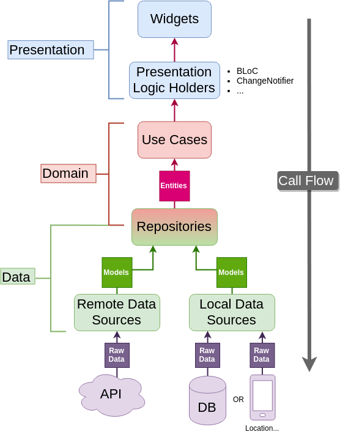
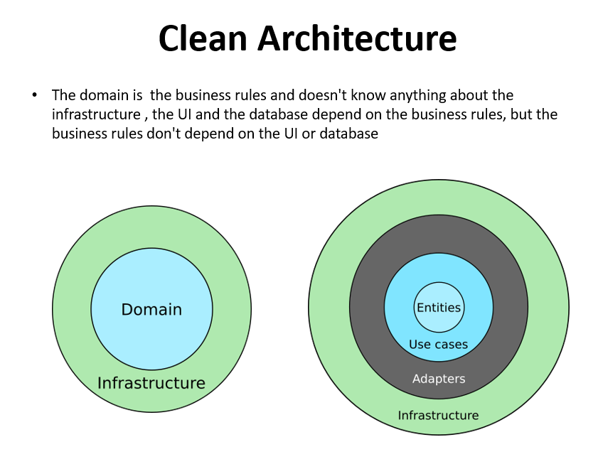

# Modular-Architecture Codebase

## CodeBase , Infrastructure and the common Layers (core-data-presentation)

### clone the project and build your project to be Clean , Testable , Maintainable and changable

- [ ] the project contain all integration to start your Project with Clean Architecture  
# Table of Contents

> Integration Details
- Union Architecture (Clean Architecture)
- Bloc Pattern
- Providers
- Cashing Integration
- Dependency Injection
- DataSrc Options (Local - Remote)
- Dio Network with BaseOptions
- Interceptor Network  
- SharedPref Abstraction
- DebugNavigation
- BuildType
- AppStartUpFlow
- AppNavigator

# Installation

1. clone the project in android studio
2. change applicationID (packageName ) as you like
3. change the project name from main like this title = "Starter Flutter"
4. may need to sync , clean then rebuild the project.

# why Modular Architecture ?

- The Project is Clean , Testable , Maintainable and changable
- High quality App with high cohesion and low coupling
- Build Time 
- Development Can be Divided
- Readable Programs
- Programming Errors are Easy to Detect
- Allows Re-Use of Codes
- Improves Manageability
- Collaboration

check my last lecture about Clean architecture and Clean Code [Lecture](https://www.youtube.com/watch?v=kFll5whDTJc&t=759s&ab_channel=AHMEDTAWFIQ)

## Usage
check the sample in the same project [Starter Flutter]https://github.com/AhmedTawfiqM/Starter-Flutter)

